<div align="center">

# VEILLEMM — Landing Page Samples

**A growing library of landing pages, designed and engineered by [Cyrus Vergara (@veillemm)](https://veillemm.netlify.app/).**

One developer. One pair of hands. From first wireframe to final deploy.

[🌐 Live Preview](https://veillemm.netlify.app/) · [✉️ Hire Me](mailto:veillemm1089@gmail.com)

---

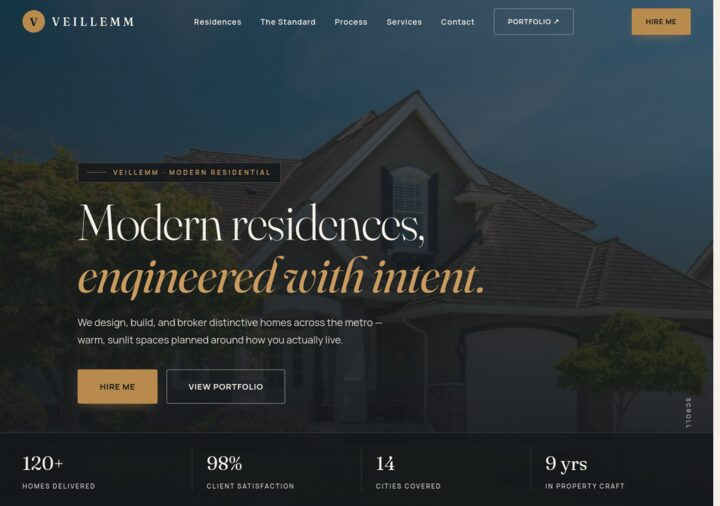

</div>

## ✦ What is this?

This is the **sample library** — a collection of standalone landing pages exploring layouts, ideas, and visual directions. These are not the full product websites; those live in the [Main Portfolio](https://veillemm.netlify.app/).

Each sample is self-contained in its own folder and opens with a single click.

---

## 🖼️ The Samples

### 1 · SEE — The Art of the Golden Hour
> Travel · *Where the sky falls in love with the sea — sunsets, beaches & paradise.*

[](See/index.html)

### 2 · VEILLEMM — Modern Residences
> Real Estate · *Engineered with intent, designed around how you live.*

[](veillemm-residences/index.html)

### 3 · VEILLEMM Market
> E-Commerce · *Everyday fresh, delivered right.*

[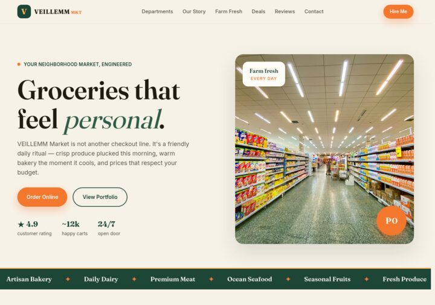](veillemm-market/index.html)

### 4 · The Danger of AI — Human Firewall
> Editorial · *A threat dossier on the last invention.*

[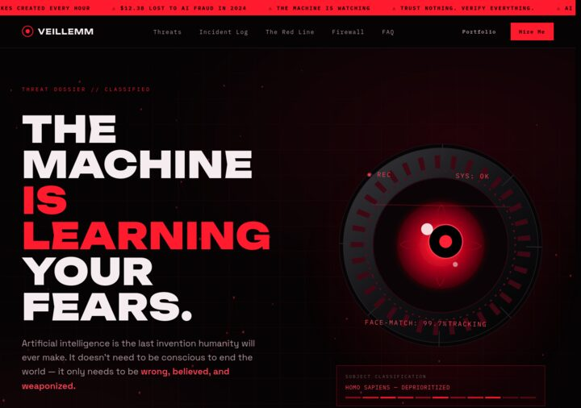](ai-human-firewall/index.html)

### 5 · VEILLEMM — Digital Product Studio
> Portfolio · *Studio-grade. Independently built.*

[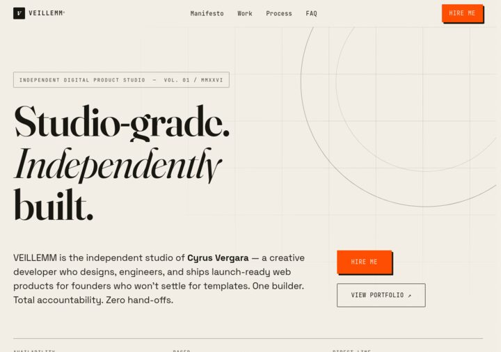](veillemm-studio/index.html)

### 6 · Cinematic Web for Music & Culture
> Portfolio · *Sites with a pulse — for artists, labels & festivals.*

[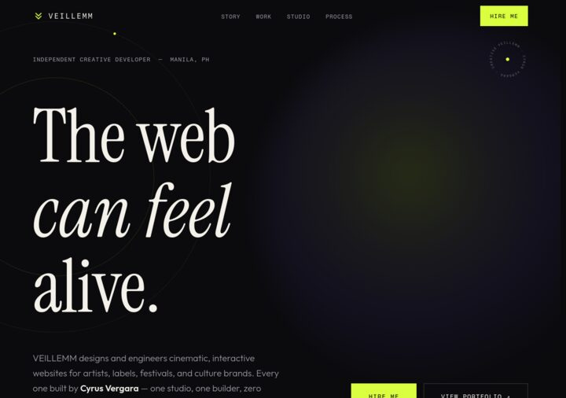](veillemm-music/index.html)

### 7 · VEILLEMM Coffee Roasters
> E-Commerce · *Slow brews for fast minds — a specialty roastery.*

[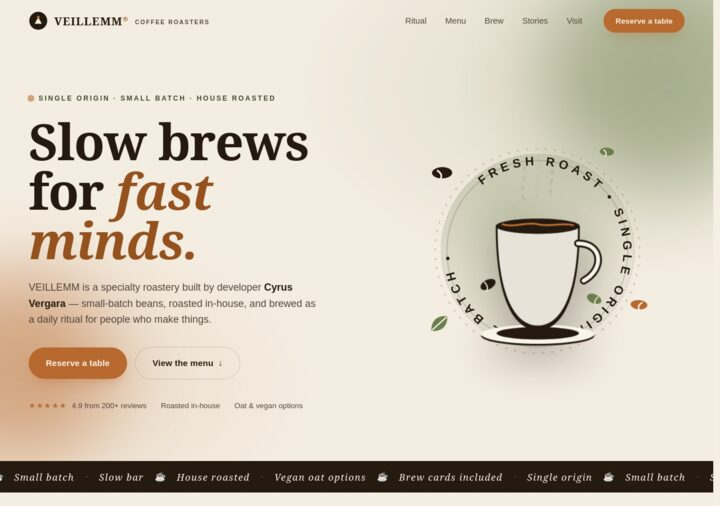](veillemm-coffee/index.html)

### 8 · VEILLEMM — Games Built Like Machines
> Games · *Arcade-grade games. One click. No installs.*

[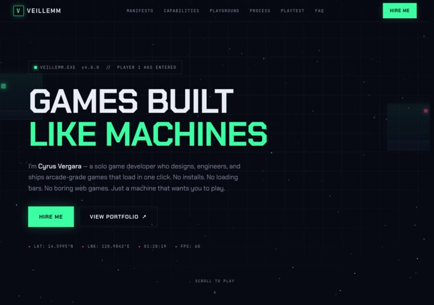](veillemm-games/index.html)

### 9 · VEILLEMM WILD — Rewilding Studio
> Brand · *Restore the wild, verify every tree.*

[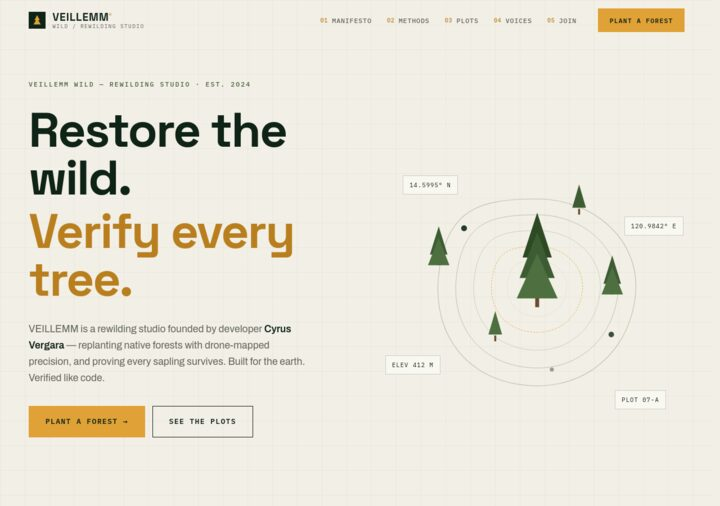](veillemm-wild/index.html)

### 10 · Clarity in the Rain
> Personal · *A developer who thinks clearest when it rains.*

[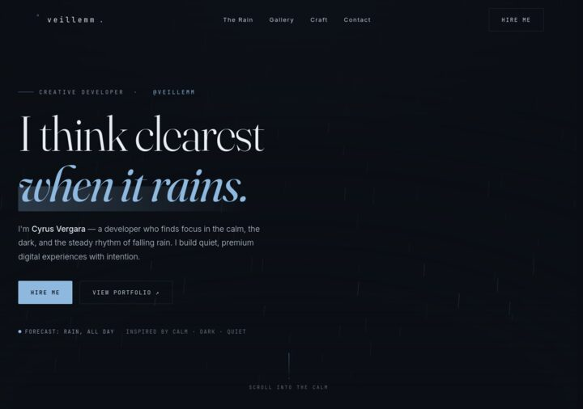](veillemm-rain/index.html)

### 11 · The 2026 Cyber Field Manual
> Editorial · *Become a cybersecurity professional in 2026.*

[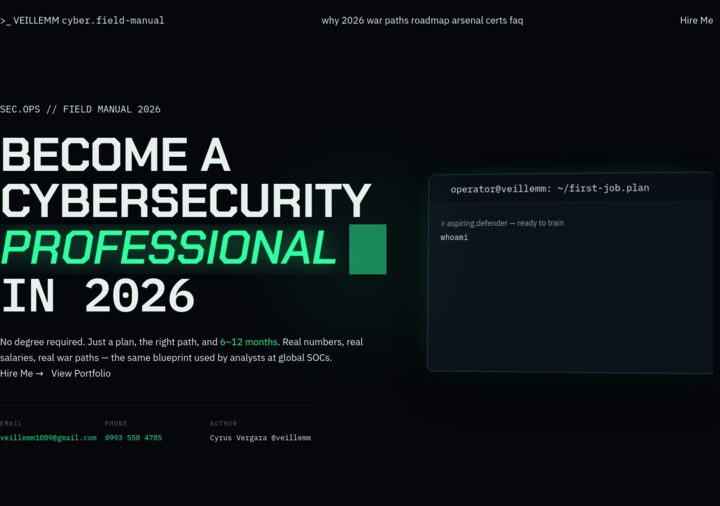](cyber-field-manual/index.html)

### 12 · VEILLEMM & CO. — Fine Timepieces
> Brand · *Hand-assembled. Individually numbered.*

[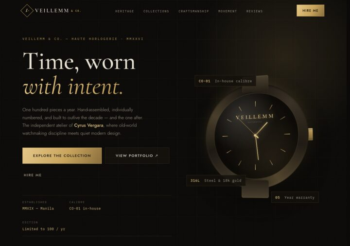](veillemm-timepieces/index.html)

### 13 · VEILLEMM — Frequency Atelier
> Personal · *Most software is noise. I build signal.*

[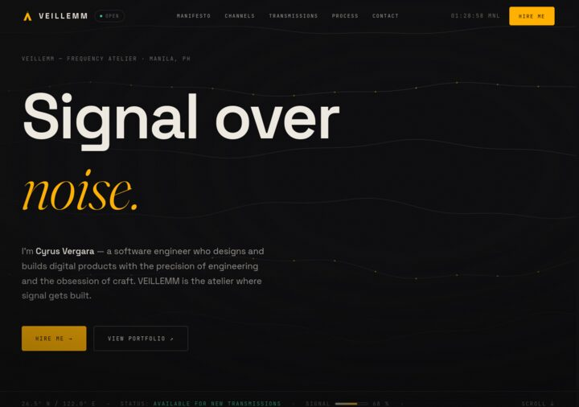](veillemm-frequency/index.html)

### 14 · MAISON DOUX — Atelier de Pâtisserie
> Brand · *Where butter becomes architecture — a 3D WebGL experience.* **Concept**

[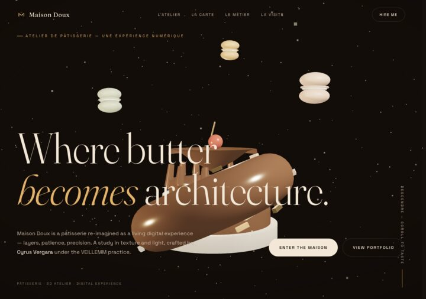](maison-doux/index.html)

---

## 🛠️ Tech Stack

- **HTML5** — semantic, accessible markup
- **CSS3** — custom properties, responsive layouts, subtle motion
- **JavaScript (vanilla)** — zero frameworks, data-driven cards
- **Google Fonts** — Sora, Manrope, IBM Plex Mono
- **WebGL** — 3D experiences (MAISON DOUX)

---

## 📁 Project Structure

```
LANDING PAGES/
├── index.html              ← the sample library (main page)
├── assets/
│   ├── thumbs/             ← card previews for every sample
│   └── me.jpg
├── css/
│   └── styles.css          ← main library styles
├── js/
│   └── main.js             ← renders cards from the PROJECTS data
└── <sample-name>/          ← each landing page is self-contained
    └── index.html
```

---

## ➕ How to Add a New Sample

1. Put your site folder inside the project (e.g. `my-new-site/`).
2. Open `js/main.js` and copy an entry from the `PROJECTS` array:

```js
{
  title: "My New Site",
  folder: "my-new-site",        // your folder name
  tag: "Brand",                 // category label
  tagline: "One short sentence.",
  c1: "#101010", c2: "#FF5C00", // gradient colors for the preview
  concept: false                // true if it's just a concept
}
```

3. Add a screenshot at `assets/thumbs/my-new-site.jpg`.
4. Done — the card appears automatically.

---

## 🚀 Run & Deploy

### Locally

Just open `index.html` in a browser, or serve it:

```bash
# Python
python3 -m http.server 8000

# Node
npx serve .
```

### Netlify (Drop)

Drag the **whole folder** into [Netlify Drop](https://app.netlify.com/drop) — the root `index.html` becomes the site, and every sub-folder (each sample) stays a working page.

---

## 📜 License

All designs and code in this library are © **Cyrus Vergara (VEILLEMM)**. All rights reserved.

<div align="center">

---

Made with ♥ by **[Cyrus Vergara](https://veillemm.netlify.app/)** · [veillemm1089@gmail.com](mailto:veillemm1089@gmail.com)

</div>
